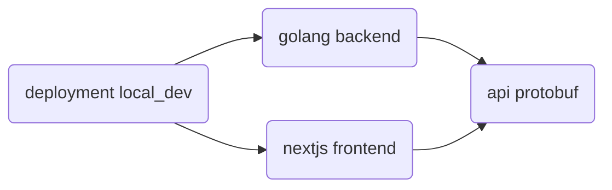

# Mako

***A make-based mono-repo and meta-repo tool***


Mako is a small but handy gnu make library for use in mono-repos (or meta-repos)
containing multiple **components** with cross component dependencies.

> Terminology: **Component**
>
> A directory containing a Makefile which includes `$(MAKO_ROOT)/component.mk` and
> implements the interface it defines.
>
> A component is usually a sub-project of a monorepo such as the frontend, the backend, a
> shared library, etc.


## Example Usage Scenario

Imagine a repository with the following structure:
```
repo_root
├── .git
├── api_protobuf
├── deployments
│   └── local_dev
├── golang_backend
└── nextjs_frontend
```

With the following dependency graph between each of these directories:


Each of these directories are **components** as defined above.

The component Makefiles define targets and prereqs as normal, but also define
cross-component dependencies, like the `golang backend` depending on the `api
protobuf`.  Transitive dependencies are not included, they are automatically
determined.  Here's an example of how dependencies are defined in a Makefile:

`deployments/local_dev/Makefile`:
```
...
define DEPS
  $(REPO_ROOT)/golang_backend
  $(REPO_ROOT)/nextjs_frontend
endef
...
```

You can then run `make -j 4 -C deployments/local_dev`.  This will make
everything in a parallel manner, and the *"parallel diamond dependency problem"*
is solved, meaning `api protobuf` is safely built and just once.

> TODO: actually implement a demo with this scenario

The unit tests in [./tests](./tests) serve as concrete examples.


## Key Design Goals

### General goals:

- Generally useful for anything you might want to run with `make` (so nearly
  anything).
  - Complementary to other build tools like bazel, pants, buck2, etc
  - Intentionally supports non-hermetic tasks (allows network connections,
    non-deterministic behavior, etc.  Anything goes!).

- Implemented as just a `make` library.
  - There's no additional binary to run or DSL to learn, it's just a `make`
    library.

- Minimal requirements.
  - Currently, it only needs very common unix tools like `mkdir`, `touch`, and
    `flock`.
  - Should easily support Linux and Darwin architectures.
    - No consideration has been put into windows.

- Each component has its own standalone Makefile with sub-make used across
  components (rather than using `include` across components).
  - This effectively makes each Makefile have its own isolated "namespace".
  - This allows running `make some_target` directly in a component's directory.
  - This reduces cognitive load when reasoning about a single components
    Makefile.

### Solve problems with sub-make usage:

Within a single `make` process, the following problems are inherently solved,
but use of sub-make requires some extra work to solve them (hence the need for
this library).

- Allow defining dependencies across components (across Makefiles) with
  automatic transitive dependency resolution.

- Allow race-free parallel sub-makes even when faced with *diamond
  dependencies*.

### Docker related goals:

- Simultaneous support for building code both:
  - not on the host workstation at all, only within docker image builds.
    - useful to support abnormal workstations.
  - only on the host workstation, without any docker usage at all.
    - useful for quick troubleshooting, simplifying creation of continuous
      integration, simplifying IDE setup, making everything work just as
      described in documentation of the tools/languages being used.

- Support checking if a component needs to be rebuilt, including due to
  transitive dependency updates, without having to build anything (including not
  building dependencies).
  - Important when using docker for building so that nothing needs to be built
    on the host environment while also avoiding calling `docker build`
    unnecessarily.

- Avoid docker-in-docker.
  - This is for fear of hitting quirks, bugs, efficiency problems, etc,
    especially when running on CI systems that may also already be running in a
    container themselves.


## Unit Tests

To run the unit tests, just run `make` in the repo root.


## Development

When working on this library, it is handy to source
[`activate-sh`](./activate-sh) into your shell (just like root [`Makefile`](./Makefile)
does before running the unit tests)

## Comparison with other build tools

> TODO: work on this section

### bazel, pants, buck2

These are designed for deterministic building of code in a hermetic environment.
They disallow or discourage non-hermetic and non-deterministic tasks.
These tools complement `mako` which can invoke them, but `mako` also needs to support
these non-hermetic and/or non-determistic cases.

### Earthly

The closest thing I've found so far to what this library does.

The main disadvantages of earthly come from the fact that it forces every build step to use docker.

Disadvantages:
- Can't build directly on the host.
- Heavy weight for small tasks.
- Forces docker-in-docker.
- Less natural to interact with host system.  `mako` needs to support tasks
  that setup the host system.

Earthly's DSL is certainly slicker than old `make` though.
